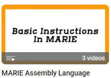
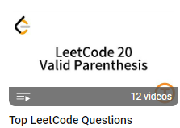

# 计算机教程秒懂系列

经营两个多月的小红书终于万粉啦！把发过的内容都整理好在这里了，很感谢大家的支持！十二月中的时候那篇三次握手突然爆火，当时也挺没想到的，感觉人生成就又+1了哈哈。
做这个秒懂系列，为了让教程简单易懂，需要四处看视频查资料，所以也是在督促自己学习吧！希望大家继续支持和喜欢这个秒懂系列！

1. [计算机网络](https://github.com/chiewhui1113/CS-Tutorial/blob/main/%E8%AE%A1%E7%AE%97%E6%9C%BA%E7%BD%91%E7%BB%9C/%E8%AE%A1%E7%AE%97%E6%9C%BA%E7%BD%91%E7%BB%9C.md)
2. [操作系统](https://github.com/chiewhui1113/CS-Tutorial/blob/main/%E6%93%8D%E7%BA%B5%E7%B3%BB%E7%BB%9F/%E6%93%8D%E7%BA%B5%E7%B3%BB%E7%BB%9F.md)
3. [算法和数据结构](https://github.com/chiewhui1113/CS-Tutorial/blob/main/%E7%AE%97%E6%B3%95%E5%92%8C%E6%95%B0%E6%8D%AE%E7%BB%93%E6%9E%84/%E7%AE%97%E6%B3%95%E5%92%8C%E6%95%B0%E6%8D%AE%E7%BB%93%E6%9E%84.md)
4. [数据库](https://github.com/chiewhui1113/CS-Tutorial/blob/main/%E6%95%B0%E6%8D%AE%E5%BA%93/%E6%95%B0%E6%8D%AE%E5%BA%93.md)
5. [计算机组成原理](https://github.com/chiewhui1113/CS-Tutorial/blob/main/%E8%AE%A1%E7%AE%97%E6%9C%BA%E7%BB%84%E6%88%90%E5%8E%9F%E7%90%86/%E8%AE%A1%E7%AE%97%E6%9C%BA%E7%BB%84%E6%88%90%E5%8E%9F%E7%90%86.md)
6. [深度学习](https://github.com/chiewhui1113/CS-Tutorial/blob/main/%E6%B7%B1%E5%BA%A6%E5%AD%A6%E4%B9%A0/%E6%B7%B1%E5%BA%A6%E5%AD%A6%E4%B9%A0.md)
7. [经验分享](https://github.com/chiewhui1113/CS-Tutorial/blob/main/%E7%BB%8F%E9%AA%8C%E5%88%86%E4%BA%AB/%E7%BB%8F%E9%AA%8C%E5%88%86%E4%BA%AB.md)

## 关于本系列
- 目前不知道怎么做图片轮播，感觉没有小红书好看，知道的可以跟我说一下啊 T_T 
- 因为刚开始都是发在小红书上面的，这个是临时整理可能没仔细检查会有错字，可以提一下 :) 
- 我用了各种各样日常/稀奇古怪的方式来比喻计算机知识，来一起说：**博主好油菜！**

## 主要平台
小红书：[TickQ](https://www.xiaohongshu.com/user/profile/604b1ba1000000000100b0ee)  
Instagram：[tickq2](https://www.instagram.com/tickq2/)  
YouTube：[TickQ](https://www.youtube.com/@TickQ-2)  
B站：[TickQ](https://b23.tv/gBTkakk)

## 教程
1. Python速成课（英）
2. MARIE汇编语言（英） 

4. LeetCode讲解（英） 

## 其他
笔记：MAT1830、FIT1047、FIT1008  
辅导：私
