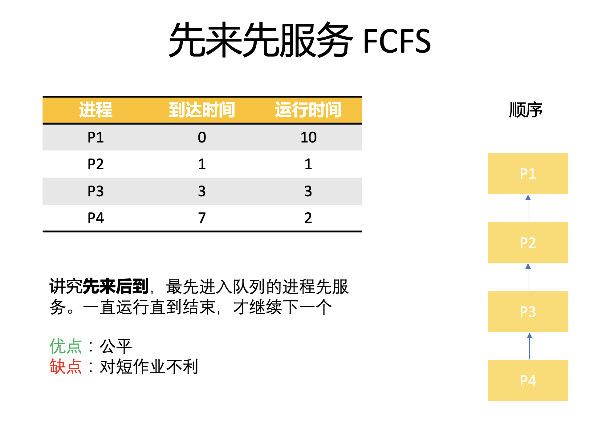
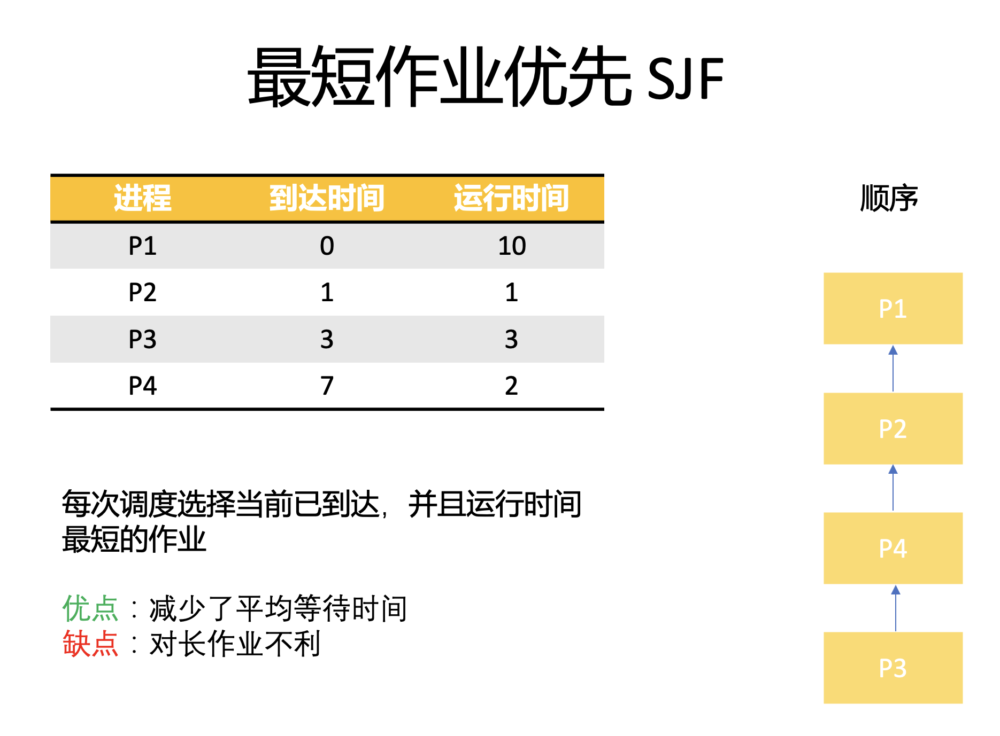
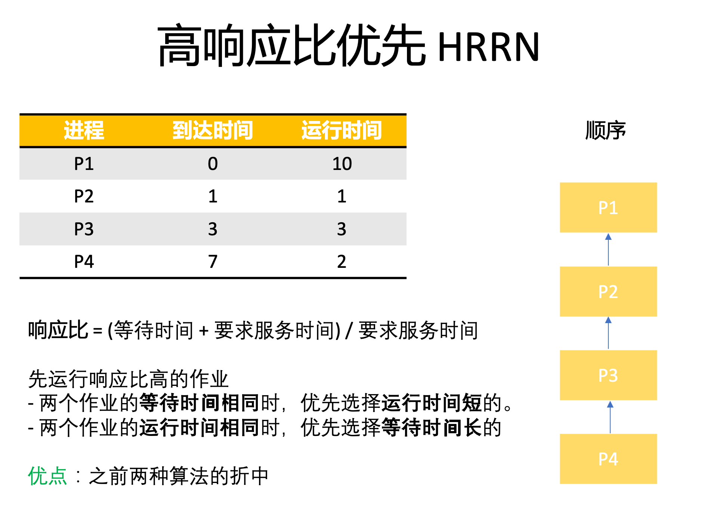

# 操纵系统的特征

调度算法是操作系统用来决定各个进程/作业在CPU上执行顺序的方法。最常见的调度算法有：FCFS、SJF、HRRN、RR、HPF和MFQ。这集先介绍前三个

## 先来先服务 FCFS
根据作业到达的先后顺序调度，CPU会一直运行直到作业结束，所以这个是非抢占式的

优点：公平，对长作业有利  
缺点：不利于短作业。假如一个长作业先运行，后面的短作业就需要等很久

## 短作业优先 SJF
每次调度选择当前已到达并且运行时间最短的作业

优点：减少平均等待和周转时间  
缺点：不利于长作业。假如队列有很多短作业，长作业的周转时间就会变长。
虽然是长作业先来的，可是一直不被运行

## 高响应比优先 HRRN
FCFS和SJF的综合，考虑到了公平性+短作业的处理。在调度时会先计算响应比，然后运行响应比最高的作业。   
响应比的计算公式为：

响应比: (等待时间 + 要求服务时间) / 要求服务时间

当作业的等待时间相同时，要求服务时间短的响应比就会更高，就会先被调度  
当作业的要求服务时间相同时，等待时间长的响应比就会更高，就会先被调度  

以上的三种算法都默认为非抢占式。SJF的抢占式版本称作“最短剩余时间优先SRTN”

## ️计算公式
周转时间 = 完成时间 - 到达时间  
带权周转时间 = 周转时间 / 运行时间  
等待时机 = 周转时间 - 运行时间  