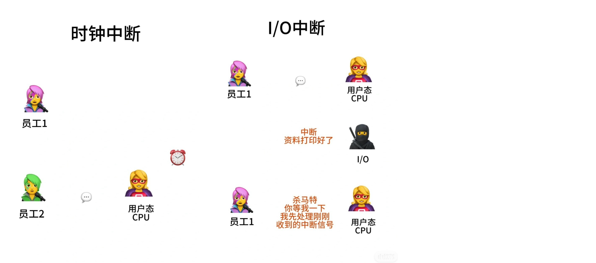

# 中断和异常

用户态：普通应用程序运行在用户态，有很多权限限制
内核态：操作系统运行在内核态，有完全的权限访问和管理所有资源（硬件，内存）
	
## 中断的作用
把CPU从用户态变内核态
	
## 异常（内中断）
和执行的指令有关，中断来源于CPU内部。分为终止，陷入和故障
1. 终止：当前执行的指令出现不可恢复的错误（在非内核态尝试执行特权指令/整数除0），会直接终止该程序
2. 陷入：应用程序主动请求操作系统服务，执行陷入指令。处理完会返回到下一个指令
3. 故障：可以被内核程序修复的错误（好像缺页故障只需要把数据从硬盘加载到内存即可）。处理完会返回之前的指令
	
## 中断（外中断）
和执行的指令无关，中断来源于CPU外部。分为时钟中断和IO中断
1. 时钟中断：系统计时器每隔一段时间给CPU发送中断信号，CPU会处理相应的时钟中断ISR（中断服务程序），然后操作系统会指定接下来执行哪个应用程序
2. I/O中断：I/O设备任务完成后会给CPU发出中断信号。CPU收到信号后会暂停当前任务，处理相应的I/O中断服务程序，处理完了再恢复执行之前被中断的任务
	
## 中断向量表
每种中断信号都有不同的ISR（中断服务程序）。CPU收到中断信号后，会在这个表查该中断类型的程序在内存中的位置
