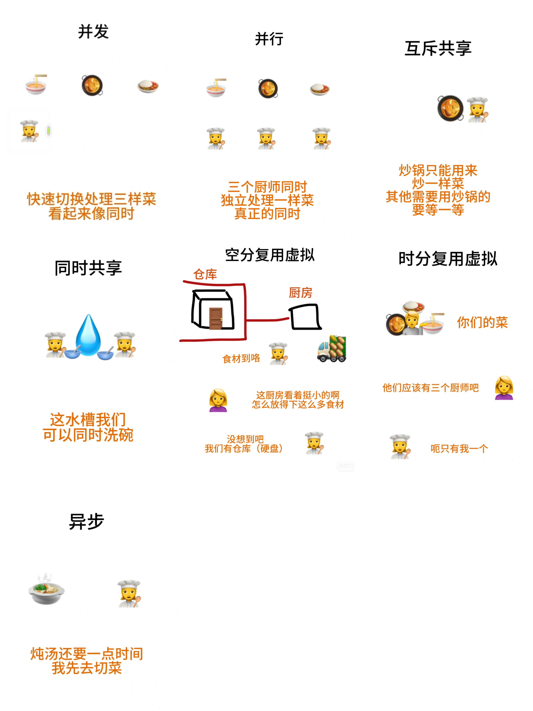

# 操纵系统的特征

1. **并发**：
一个厨师（单核CPU）快速切换轮流处理三样菜（进程），看起来像同时处理
	
2. **并行**：
有多个厨师（多核CPU），每个厨师独立处理一样菜（进程），真正的同时处理
	
3. **互斥共享**：
某个资源可以给多个进程使用，但是一个时间段内只允许一个进程访问某个资源（摄像头，在一个app打视频就不能同时在另一个app打视频）
	
4. **同时共享**：
一个时间段内允许多个进程同时访问资源（文件，可以同时在两个app发文件）
	
5. **空分复用虚拟**：
内存不够时，计算机会把不常用的数据从内存转到硬盘，这叫虚拟内存管理。假如需要访问移到硬盘的数据，再把它们加载到内存。不过用户看着会以为超出了实际内存也可以运行
	
6. **时分复用虚拟**：
虽然只有一个CPU（实际上），但是操作系统通过时间片把CPU的时间分配给不同进程，因为时间很短用户就感觉（逻辑上）像是同时执行多个进程
	
7. **异步**：
异步处理就是等待一个长时间操作的时候先去执行别的任务，不用等这个操作完成。因此执行的时间和顺序是不确定的
	
## 四个特征总结
并发：多个进程在同一时间段能“同时”执行    
共享：多个并发进程可以同时使用同一资源    
虚拟：将单一的物理资源分割成多个逻辑资源    
异步：多个进程执行的时候是走走停停，所以执行顺序和时间不确定    
	
## 虚拟这句话可能比较懵，比喻一下
有一栋大楼（物理资源），里面被划分成很多个公寓（逻辑资源/虚拟内存空间）。每个公寓都是独立的虚拟环境，居民（进程）在公寓里可能觉得自己独占了整栋楼，其实是和其他进程共享。所以虚拟化让进程在共享物理资源的同时，又有一种自己完全独立控制资源的错觉
