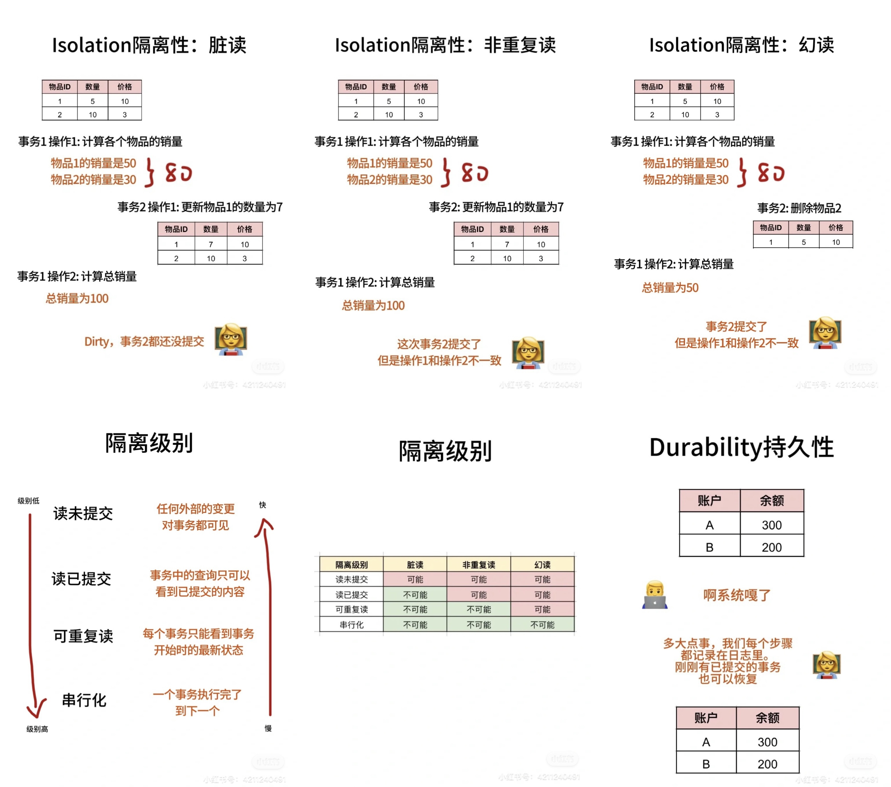

# ACID

为了保证数据库管理系统（DBMS）的事务正确及可靠，具备了ACID四种特性：
	
## Atomicity 原子性
事务中的操作要么全部完成，要么全部不完成。中途出错就回滚到最初的状态
	
## Consistency 一致性
在事务开始前和结束后，数据库的状态都一致，满足所有限制条件
	
## Isolation 隔离性
并发执行的事务互不干扰，独立运行
	
- **情况1: Dirty Read 脏读**  
一个事务读取到了另一个事务未提交的数据。那份数据有可能被回滚=不存在
- **情况2: Non-repeatable Read 不可重复读**  
一个事务读取到了另一个事务已提交的更新数据。但是和之前的数据不一致
- **情况3: Phantom Read 幻读** 
一个事务读取到了另一个事务已提交的增删数据。但是和之前的数据不一致
	
隔离级别在p6 p7，有读未提交（Read Uncommitted）、读已提交（Read Committed）、可重复读（Repeatable Read）和串行化（Serializable）
	
## Durability 持久性
事务提交=永久结果。系统坏了天塌了，这个事务对数据库的更改还在。所以事务提交前需要把更改写入到Logging（日志），系统崩溃就从这里恢复数据
