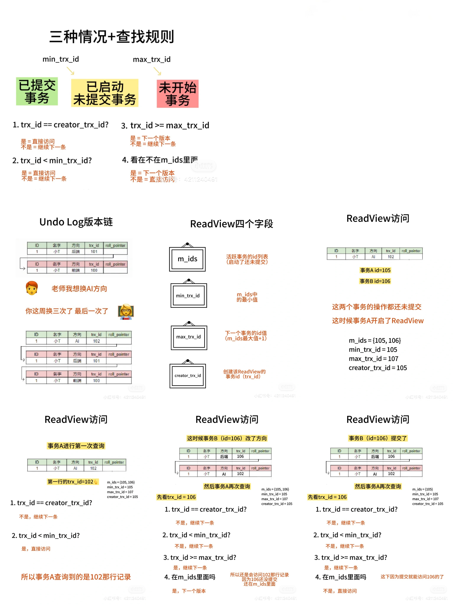

# MVCC原理

MVCC（multi-version concurrency control）多版本并发控制是用于实现ACID中的隔离性的一种机制。它的存在是为了解决脏读和不可重复读
	
注：MVCC是无法单独解决幻读的，只有串行化（Serializabke）才能防止幻读
	
MVCC是基于隐藏字段、Undo Log和ReadView实现的
	
## 隐藏字段
1. trx_id：事务ID，标识了进行该记录最后修改的事务
2. roll_pointer：回滚指针，指向该记录的上一个版本
3. row_id：如果表没有指定聚集索引，就会用row_id来创建聚集索引
	
## Undo Log
每次增删改的操作都记录在Undo Log
	
## Read View
快照读的时候会有一个读视图，分为四个部分：
1. m_ids：活跃事务的id列表，活跃事务就是启动了还未提交的事务
2. min_trx_id：m_ids中的最小值
3. max_trx_id：下一个事务分配的id（m_ids最大值+1）
4. creator_trx_id：创建该ReadView的事务id

## 规则
至于读到哪个版本的数据，分为以下规则：
1. 判断该版本是否为当前事务创建（creator==trx_id）
- 是，代表这个当前版本是这个事务修改的，当然可以看
- 不是，—> 2
	
2. 判断该版本是否在ReadView生成前提交（trx_id < min_trx_id)
- 是，代表这条记录已经提交了，当然可以看
- 不是，—> 3
	
3. 判断该版本是否在ReadView生成之后开启（trx_id > max_trx_id)
- 是，不能被当前事务访问，下一个版本
- 不是，—> 4
	
4. 判断创建ReadView时是否已经提交（在不在m_ids里）
- 是，修改的事务还没提交不能看，下一个版本
- 不是，已经提交可以看
	
MVCC只会在读已提交（Read Commited）和可重复读（Repeatable Read）这两个隔离级别生效。在RC级别下，每次快照读都会生成新的ReadView。在RR级别下，只有第一次会生成新的ReadView，后续都是用第一次的ReadView

## 提问
**cohao酱**：判断该版本是否为当前事务创建（creator==trx_id） 这里的creator是哪来的呢？

**答**：creator是创建ReadView的事务id。好像p4我们看到有三个trx_id（102、105、106），但是是trx_id为105的事务A开的ReadView，所以105就是creator。
p6的话，还是事务A开的ReadView，所以creator还是105。不过因为版本里有106和102两条记录，所以要从上面开始跟着那四个条件看，看应该给creator查看哪一个版本。
这里就是对比creator和trx_id，不同版本
