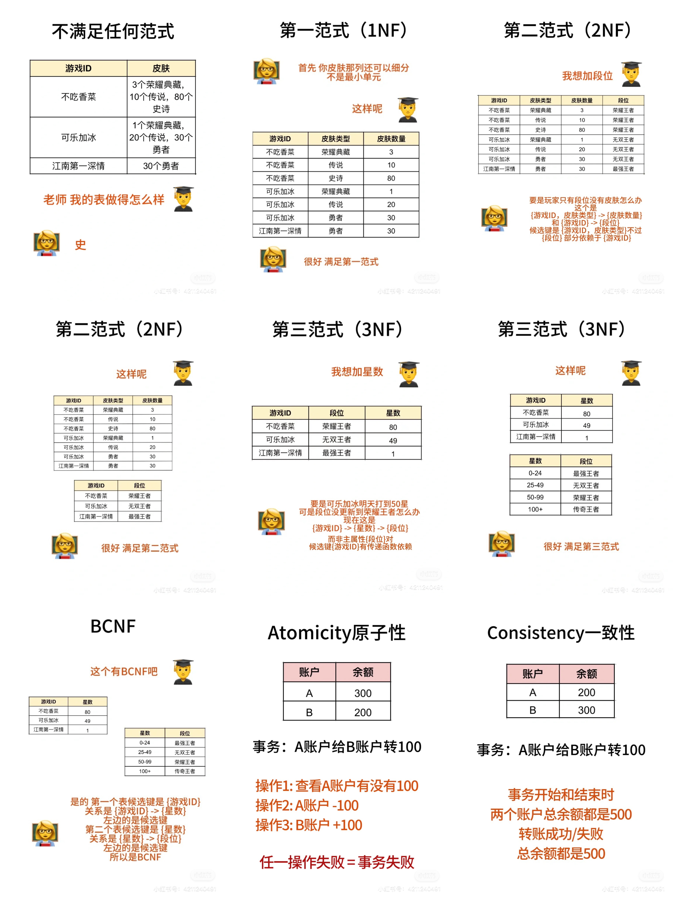

# 数据库范式 (1NF - BCNF)

为了避免数据的冗余和增删改异常，有几种数据库范式，这里只会说前四个函数依赖的
	
## 第一范式（1NF）
表中的每一列不能再细分。好像图里皮肤可以分为类型和数量。需要把它拆开满足第一范式
	
## 第二范式（2NF）
非主属性要完全函数依赖于某一个候选键，要是出现部分依赖就不满足。好像{A, B} -> {C}，{A} -> {C}，
A是候选键{A, B}的一部分，不过{C}只部分依赖{A}而不是{A, B}，这个例子就不符合第二范式。好像图里的例子，
因为部分依赖，要是玩家只有段位没有皮肤，就不加上去表了。所以可以拆开成两个表来满足第二范式
	
## 第三范式（3NF）
非主属性不能传递依赖于候选键。假设A是候选键，C是非主属性，{A} -> {B}, {B} -> {C}，
C就可以通过B依赖于候选键A，这就是传递函数依赖。不过注意，要是这里{B} -> {A}就不是传递函数依赖
	
## BCNF
所有属性（主属性和非主属性）都完全函数依赖于候选键。做题只需要看左边的决定因素是不是都是候选键就可以。
假如候选键是{A,B}，依赖是{A,B} -> {C}，{B} -> {D}, {D} -> {B}，这满足第三范式因为没有传递依赖，
但是左边的{B}不是候选键，{B}和{A,B}不一样，所以不满足BCNF
