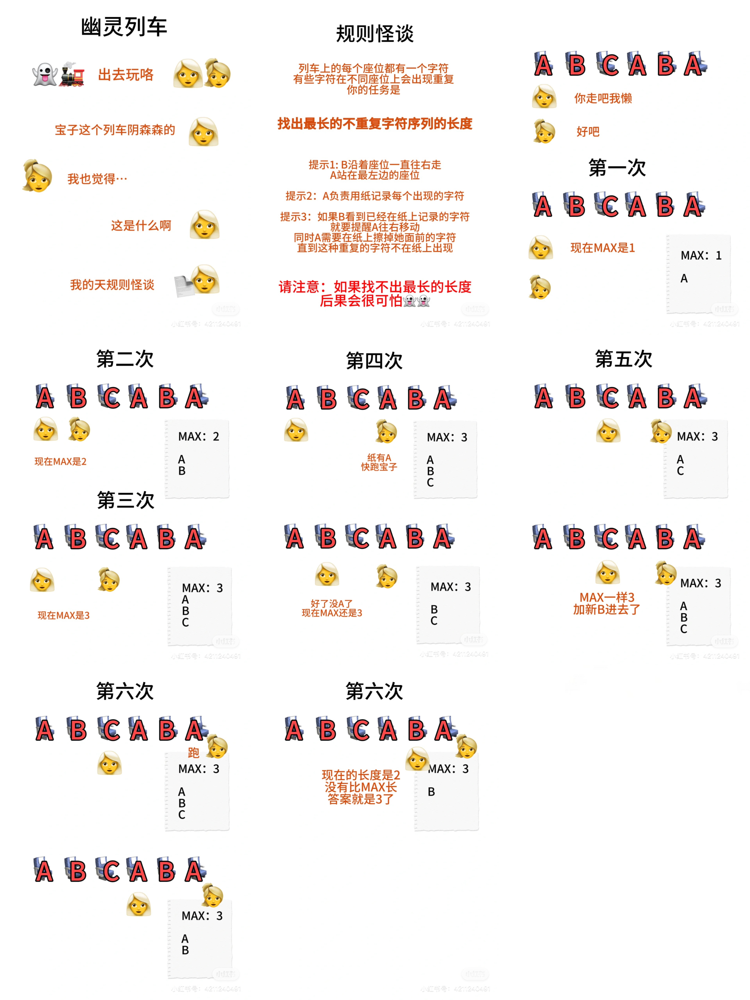

# LeetCode 3: 无重复最长字符


```C++
int lengthOfLongestSubstring(string s) {
    int maxLen = 0; // MAX
    unordered_set<char> hash; // 记录的纸

    int left = 0; // 左边站着的A
    for (int right = 0; right < s.length(); right++) { // 负责走的B
        // 假如看到已经在纸上记录的字符，A要删除当前字符然后往右移动
        while (hash.count(s[right])) { 
            hash.erase(s[left]); // 删除
            left++; // left往右走一步
        }
        hash.insert(s[right]); // 把right指向的字符加进去
        maxLen = max(maxLen, right - left + 1); // 更新MAX
    } 
    return maxLen;
}
