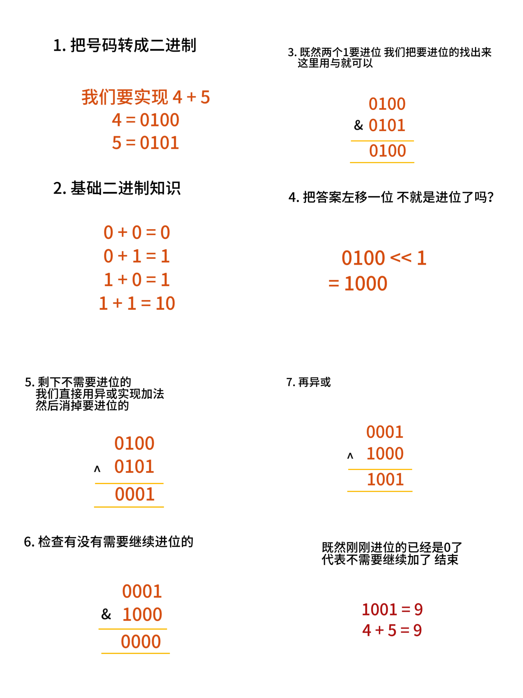

# LeetCode 55：跳跃游戏



```C++
int getSum(int a, int b) {
    while (b) { // 0就代表不用继续加了 退出循环
        int sign = (a & b) << 1; // 找进位
        a ^= b; // 剩下的加起来
        b = sign;
    }
    return a;

    // a = 0100
    // b = 0101

    // sign = 0100
    // sign = 1000

    // a ^= b --> 0001
    // b = 1000

    // sign = 0000
    // sign = 0000

    // a ^= b --> 1001
}
