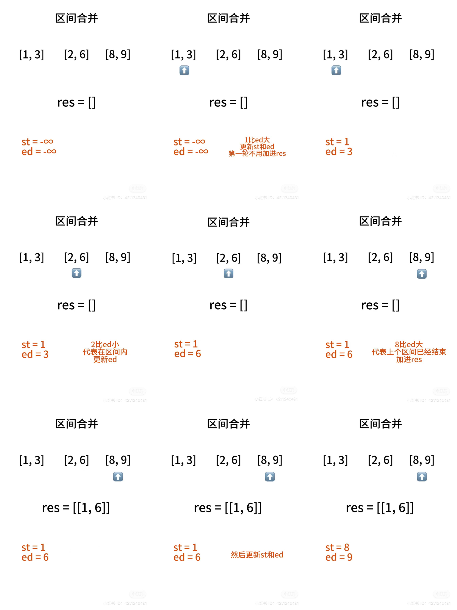
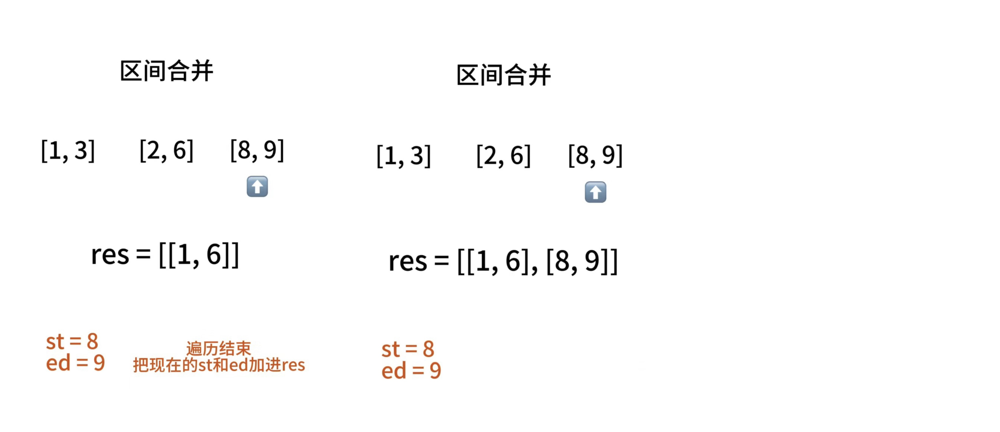

# LeetCode 56：区间合并




```C++
vector<vector<int>> merge(vector<vector<int>>& intervals) {
    sort(intervals.begin(), intervals.end());
    int st = -2e9, ed = -2e9;
    vector<vector<int>> res;
    for (auto inter : intervals) {
        if (inter[0] > ed) { // 不在区间内
            // 不是第一次就加进res
            if (st != -2e9) res.push_back({st, ed});
            // 更新st和ed
            st = inter[0], ed = inter[1];
        } else { // 在区间内
            // 更新ed
            ed = max(ed, inter[1]);
        }
    }
    if (st != -2e9) res.push_back({st, ed});
    return res;
}
