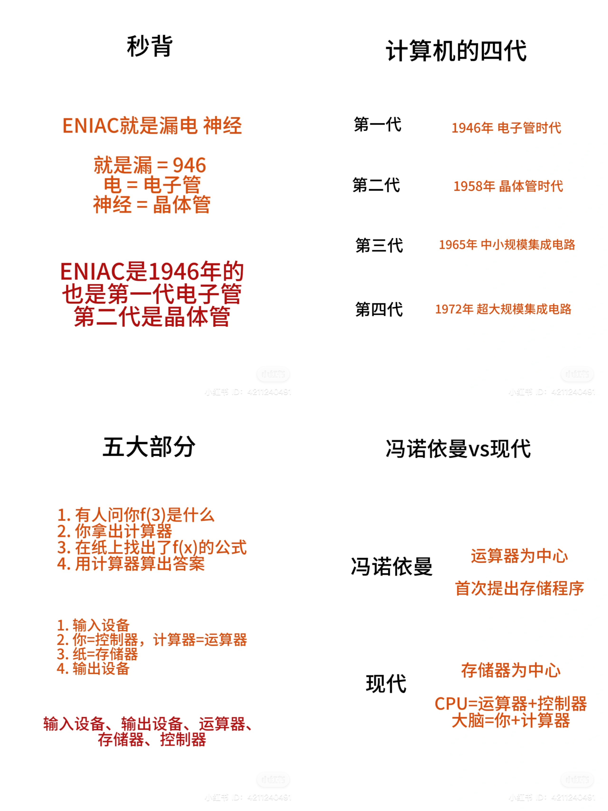

# 计算机发展阶段和硬件基本组成

## 计算机发展历程
1. 第一代（1946-1957）：电子管时代
ENIAC是第一台计算机，1946年推出。非常大，而且耗电
	
2. 第二代（1958-1964）：晶体管时代
开始用磁带、磁鼓，计算机也变得更小、更快、耗电低
	
3. 第三代（1965-1971）：中小规模集成电路
引入了分时操作系统、高级语言迅速发展
	
4. 第四代（1972-现在）：超大规模集成电路
出现微处理器、微型计算机
	
## 计算机硬件基本组成
五大部分
1. 输入设备：将信息转成二进制
2. 输出设备：将二进制转成信息
3. 运算器：进行算术/逻辑运算
4. 控制器：指挥各部件使程序运行
5. 主存储器：存放数据和程序
	
冯诺依曼结构
- 运算器为中心
- 存储程序：把要执行的指令先存在主存储器
	
现代计算机结构
- 以存储器为中心
- CPU = 运算器 + 控制器
