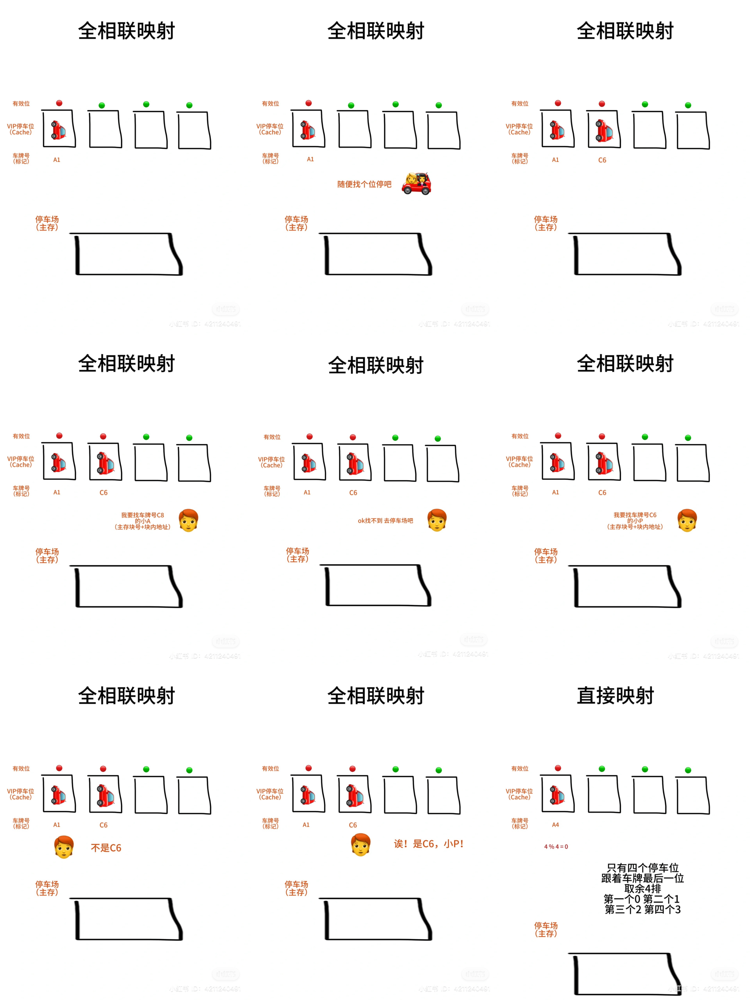
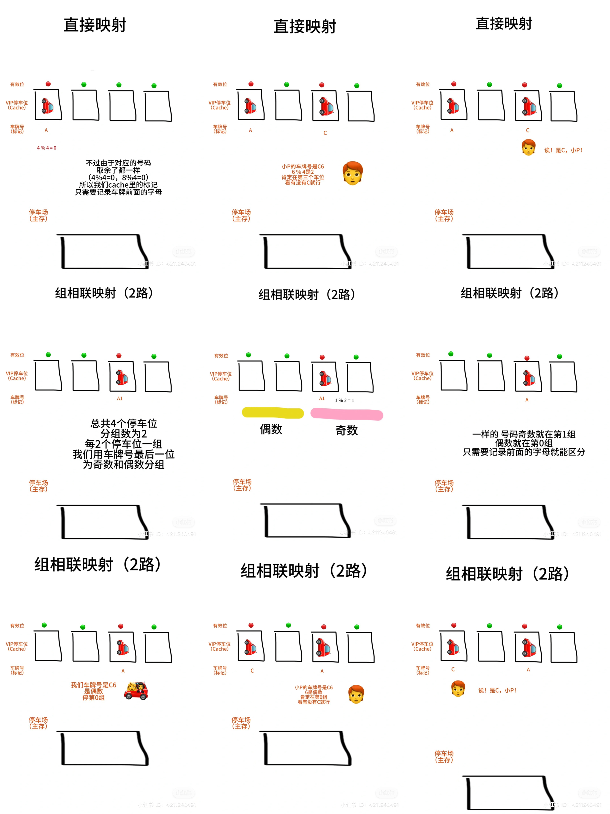

# Cache和主存的三种映射方式

因为内存（主存）和CPU相比很慢，所以会复制一份频繁使用的代码到Cache。
Cache是用SRAM实现的，比DRAM的内存快几十倍上百倍，所以解决了这个问题。但是成本高，所以容量很小
 
## Cache和主存三种映射方式
1. 全相联映射：可以放到Cache中的任意位置，随便放，很好地利用了Cache的空间，但是查找要一个一个查很慢
 
2. 直接映射：放到Cache中的特定行（主存块号%总行数）。好像例子里，主存块号是车牌号，总行数是四个停车位。
计算机里的话，总行数是总Cache行。这个查找很快，但是不能很好利用空间。好像要是车牌号一直是A4，B4，C8，只会用到第一个停车位
 
3. 组相联映射：Cache会分组，图里每一组有两个位，所以叫2路。主存块分类的位置就是“主存块号%总组数”，
好像例子里分成了两组，奇数%2一定是1，偶数%2一定是0。这个综合了上面的两个映射
 
## 注
1. Cache中需要有效位（0/1），因为Cache的默认标记都是0，不过不一定代表标记0都映射到主存块号0。所以有效位可以让我们知道当前标记有没有效
2. 我把名字当成块内地址，车（数据块）里有多个人（多个地址）
