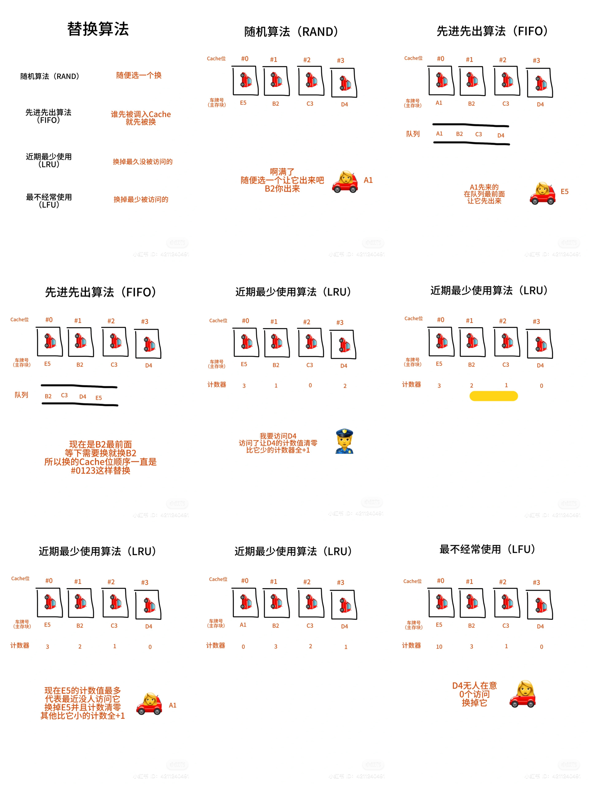

# Cache替换算法

当Cache满了但需要加载新主存块的时候，就需要替换算法。替换算法只应用在全相联和组相联映射，因为直接映射可以直接替换
	
1. 随机算法（RAND）
随机选一个主存块替换
	
2. 先进先出算法（FIFO）
最先进入Cache的主存块就先被替换，FIFO也是队列的思想
	
3. 近期最少使用（LRU）
替换最久没被访问过的主存块。用计数器记录，访问/替换了就把当前主存块的计数值清零，其他比它小的计数器的值+1
	
4. 最不经常使用（LFU）
替换访问次数最少的主存块，计数器来记录被访问了多少次
