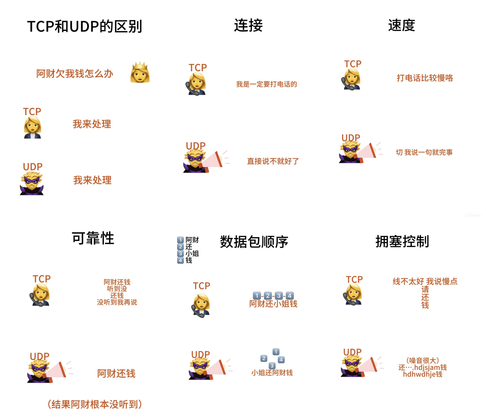

# TCP和UDP的区别

## 连接性
**TCP面向连接，UDP无连接**  
TCP传输前需要先握手建立连接，好像打电话要等别人先接电话 
UDP不管接收方有没有准备好都直接发，所以无连接

## 可靠性
**TCP 可靠，UDP不可靠**  
TCP有确认重传机制确保数据正确传输，所以很可靠  
UDP不管，有可能丟包/出錯/重复，所以不可靠

## 速度
**TCP慢，UDP快**  
TCP需要建立连接，检查有没有出错，调整等，一堆事做所以慢  
UDP不管直接发送所以快

## 数据包顺序
**TCP有序，UDP可能无序**  
TCP会保证数据包的顺序和完整性  
UDP有可能中途丟包或者顺序不对

## 拥塞控制
**TCP会控制，UDP不会**  
TCP会根据网络情况调整传输速率，减少网络拥塞  
UDP不管，拥塞也发，所以可能导致网络更拥塞

## 怎么秒背
TCP像严谨可靠的尺姐，UDP像什么都不管的闪电侠

## 应用场景
TCP用在需要可靠数据传输的场景，像网页、邮件、文件传输，因为我们不想要丢失任何数据  
UDP用在实时的场景，像直播、视频通话、游戏，点数据丟了无碍，不过不要延迟

## 其他
1. momo："...越来越多的高层协议嫌弃tcp开支过大，转用udp了。他们在udp之上自己解决可靠连接" (QUIC)
2. 还有很6的表情包在小红书评论区
