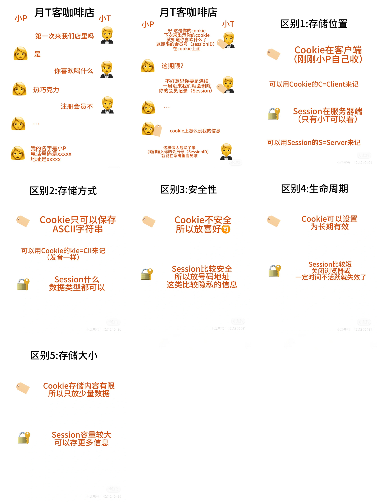

# Cookie和Session的区别

## Cookie
存储在用户浏览器的一小块数据。第一次访问服务器的时候，服务器会给你发送cookie。Cookie会存储
sessionID和偏好这些

## Session
用于存储用户的会话信息，好像用户身份信息，状态和安全性相关的数据

## 过程
我们输入用户名和密码登入网站的时候，服务器会验证这些信息。假如验证成功就创建一个新的会话(session），然后把sessionID存储在cookie中。
sessionID是为了区别不同的session，好像我们现在登入的状态就是一个session。
浏览网站其他界面的时候浏览器会自动发送cookie，假如cookie中的
sessionID没过期就不用重新登入，过期了就需要重新输入用户名和密码。不过就算cookie中的
sessionID过期了，它还是记住用户的偏好设置的，好像界面语言等

## 区别
1. 存储位置
cookie 存储在客户端（用户的浏览器），Session存
储在服务器端，只有服务器可以访问
2. 存储方式
cookie只能存储 ASCll 字符串，Session什么数据类
型都可以存储
3. 安全性
cookie 因为存储在客户端相对不太安全，Session因为存储在服务器上相对更安全
4. 生命周期
cookie可以设置为长期有效，Session通常在用户关闭浏览器或者一定时间不活跃后就失效了
5. 存储大小
Cookie 的存储容量只有 4KB，所以一般存储少量数据。Session存储容量较大，可以存储更多的用户信息
