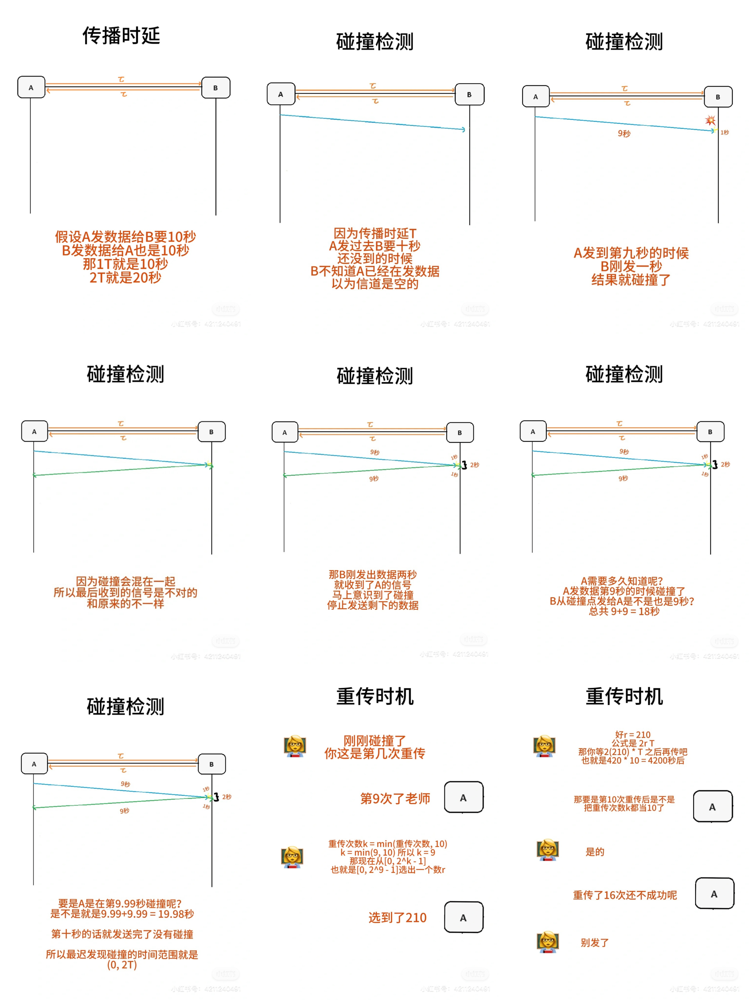
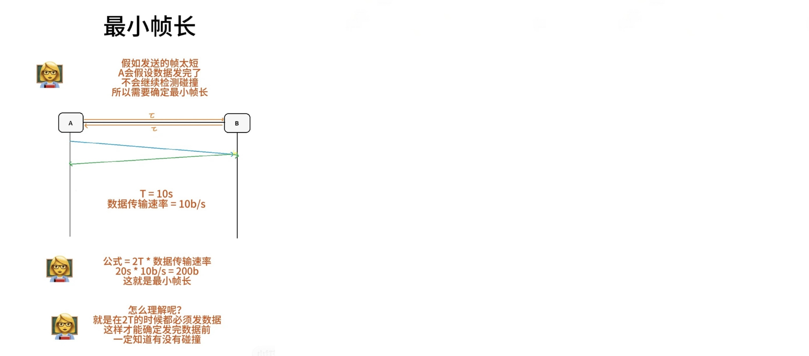

# CSMA/CD协议

## 单词
1. CS (Carrier Sense）载波监听  
发送数据之前和发送数据时，都需要检测总线上有没有其他计算机在发送数据
2. MA(Multiple Access）多点接入  
多台计算机连在一根总线上
3. CD (Collusion Detection) 碰撞检测  
边传边听，检测有没有碰撞，碰撞就停止发送数据，随机时间后重发

## 传播时延T
信号从A点传播到B点所需的时间

## 最迟等多久
(0, 2T)  
因为 A的数据信号有可能在很接近B点的时候B发数据了，这也会碰撞。2T也叫争用期/碰撞窗口 

## 碰撞后停发＋重传
一检测到碰撞就停发。然后用二进制指数退避算法決定等多久后重传
1. 争用期为2T
2. 重传次数k = min(重传次数，10）
3. 从[0, 2^k -1]中随机选个数
4. 退避时间为2r T
假如重传16次后还不成功，就停止重传向上报错

## 最小帧长
要是帧太短，A很快地把数据发完，但是因为传播速率可能在中途碰撞。
不过A都发完了不会继续检测和重传，所以要确定最小帧长  
公式：2T * 数据传输速率  
注：以太网最小帧长为 64字节/512比特
