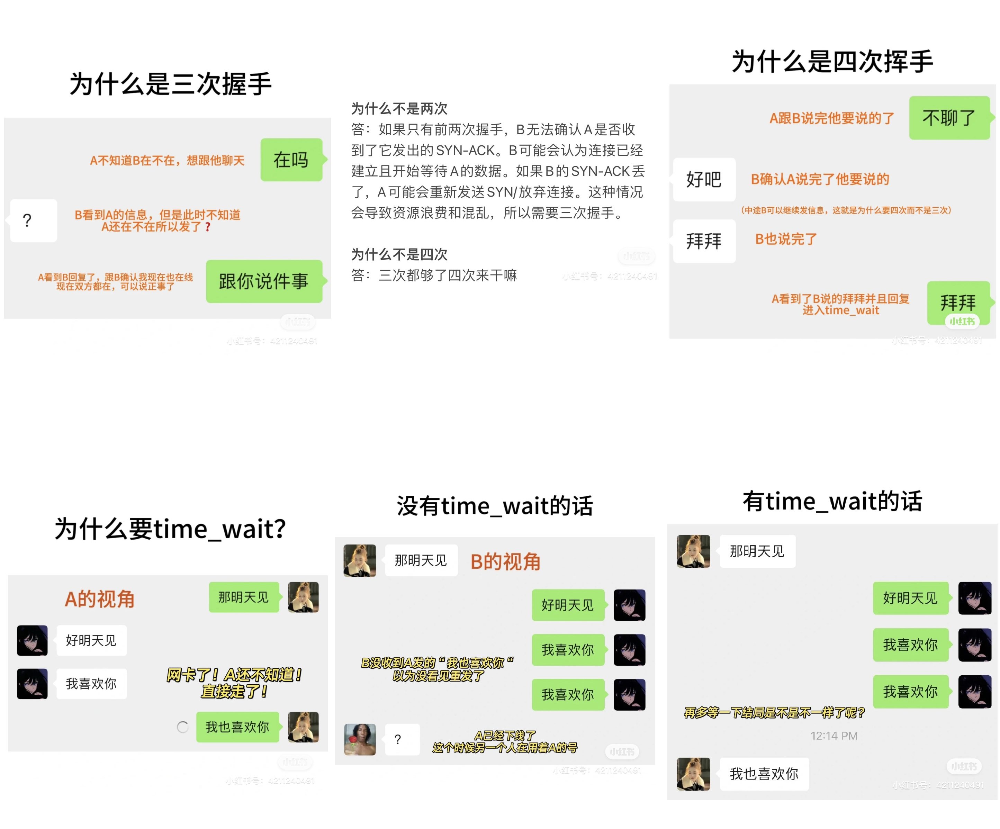

# 为什么是三次握手？什么是time_wait？

## 为什么不是两次？
如果只有前两次握手，B无法确认A是否收到了它发出的SYN-ACK。B可能会认为连接已经建立且开始等待A的数据。
如果B的SYN-ACK丢了，A可能会重新发送SYN/放弃连接。这种情况会导致资源浪费和混乱，所以需要三次握手。

## 为什么不是四次？
三次都够了四次来干嘛

## 为什么是四次挥手不是三次？
因为TCP是全双工，代表A和B两边都能独立传输。A发给B“FIN“的时候代表A发完了，但是不代表B发完了。
B发一个ACK给A是为了表示自己知道A结束了。要是B不发ACK，A就会以为B没看到一直发FIN。
等B传完数据B才会再发FIN，所以需要四个。

## 什么是time wait?
先发送FIN的A最后一个ACK可能会丢失。B没收到A的ACK 就会重发FIN。要是A刚刚没进入
time_wait 直接刪除套接字和保存的端口号，原先A的端口号可能被分配给了另一个程序C。
这时候B的FIN就会误发给C，C也会执行断开操作，结果就是()
