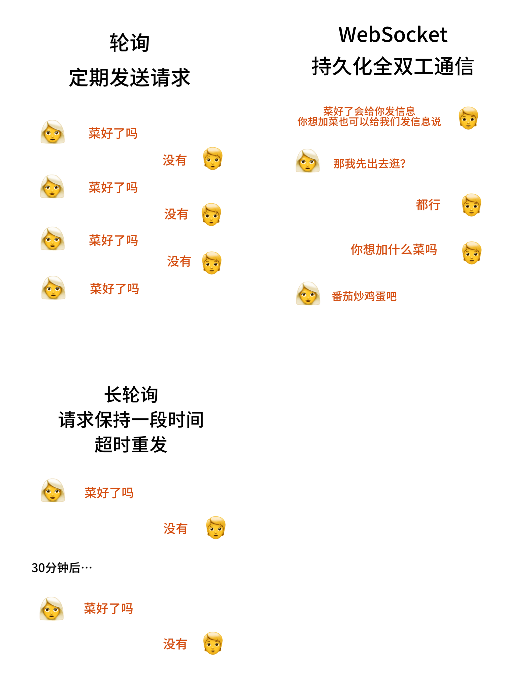

# 什么是WebSocket

 
WebSocket是HTML5定义的一种协议，可以让客户端和服务器建立全双工通信。它建立了可持久化的TCP连接，这个连接会保持开放直到客户端/服务器决定关闭它
 
HTTP有1.0和1.1版本，HTTP 1.0默认TCP连接只处理一个请求和响应，然后结束。HTTP 1.1新增了Connection: keep-alive，让TCP连接可以发送多个请求和接受多个响应。
 
在websocket之前，为了实现实时通信通常会使用轮询和长轮询，这两种技术在HTTP 1.0和1.1都适用。轮询就是让客户端定期主动发送HTTP请求来获取最新信息，长轮询可以把GET请求保持一段时间，但是超时后客户端还是要重发请求。所以这两个技术都会造成资源浪费和延迟
 
实现WebSocket可以解决这一点。客户端会先给服务器发送一个HTTP请求开始一个WebSocket握手，请求里包含Upgrade：websocket。要是服务器同意的话就会返回一个101 响应，这下双方都可以在这个连接上自由地进行数据传输