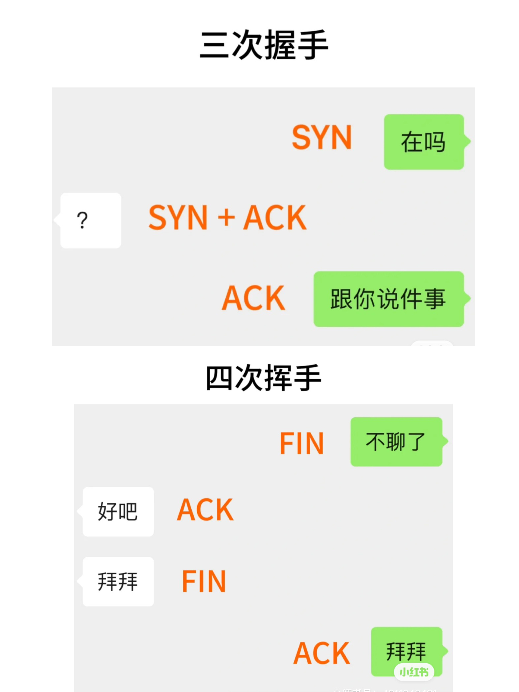

# 什么是三次握手四次挥手

## 三次握手：
1. 在吗 (SYN)：A向B发送建立连接的请求
2. ？(SYN+ACK)：B确认收到了A的请求，并向A发送同意建立连接的信号
3. 跟你说件事 (ACK)：A收到B的确认后，再次发送确认信息，此时已经建立连接可以开始数据传输

## 四次挥手：
1. 不聊了(FIN)：A告诉B它要关闭连接
2. 好吧 （ACK)：B收到A的结束连接请求，发送确认
3. 拜拜 (FIN)：B告诉A它也要关闭连接
4. 拜拜 (ACK)：A收到B的结束请求后，发送确认，断开连接

在三次握手和四次挥手的时候，发送方为了确保不丢包会有一个计时器。如果在预定时间内未收到对方的
ACK，就会假设丢包了且重新发送。好像我们发"在吗〞，如果对方很久都不回复，可能会假设对方没看见，再发一次"在吗"

## 单词
ACK: Acknowledgment，确认收到  
SYN: Synchronize，开始连接 
FIN: Finish，结束连接 
