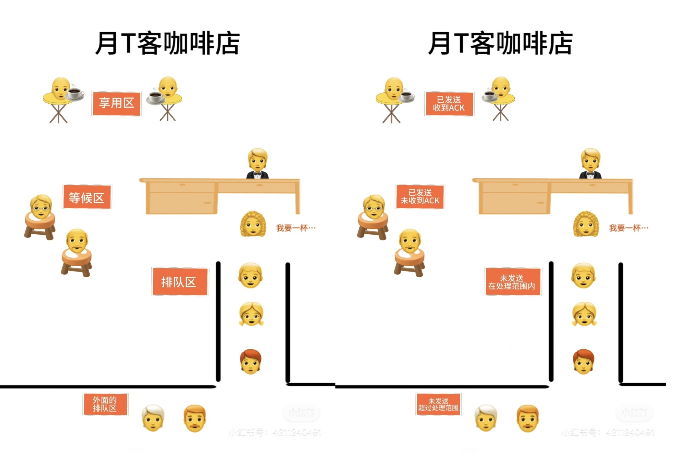

# TCP滑动窗口

在TCP中，由于发一次数据等待一次ACK效率太低，就引入了滑动窗口这个概念。发送方和接收方各有滑动窗口：

## 发送方
1. 已发送并收到ACK  
这部分数据已经发送并被接收方确认，好像已经点了咖啡并收到了咖啡

2. 己发送未收到ACK  
这部分数据已经发送但是还没被接收方确认，好像已经点了咖啡但是咖啡还没做好

3. 末发送但在接收方处理范围内  
这部分数据准备发送，并且在接收方处理范围内，好像在店里的排队区等待

4. 末发送但超出接收方处理范围内  
这部分数据准备发送，但是超出了接收方处理范围，好像在店外的排队区等待

## 接收方
1. 己接受并确认的数据  
这些数据已经被接收并处理，好像已经处理好的咖啡订单

2. 未收到但可以接收的数据  
这些数据准备接收但还末收到，好像店里的排队区

3. 未收到但不可以接收的数据  
这些数据因为滑动窗口大小限制无法被接收，好像店外的排队区，店里不够位了
 
TCP的窗口大小是由接收方决定的，要是发送方一下发太多接收方会觉得难以承受，无法正常接收数据。
等接收方给发送方发送了ACK，滑动窗口就可以向右移发送更多数据。就好像咖啡店里处理完了现在的订单，可以处理之后的其他订单一样
