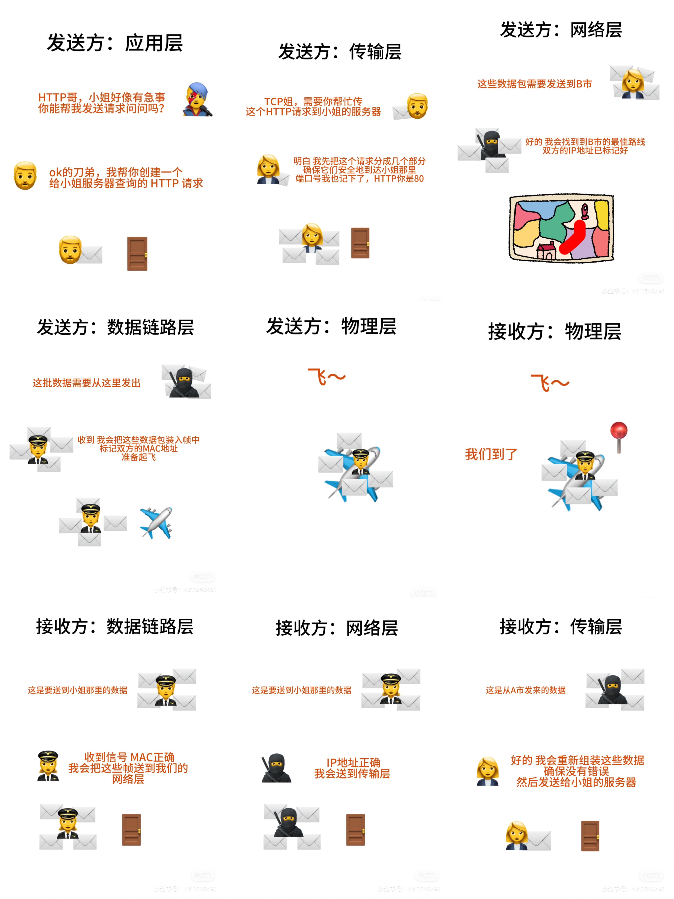

# 网络五层模型

## 发送方：应用层 (HTTP/HTTPS, DNS, SMTP, FTP)
阿刀用HTTP协议向小姐的服务器发送一个请求

## 发送方：传输层 (TCP, UDP)
HTTP请求被TCP处理，它会把请求分成几个小的数据包，并指定端口号（HTTP的是80）

## 发送方：网络层(IP)
IP接管，为每个数据包标记源和目的地的IP地址，井确定到B市的最好路径 (OSPF, RIP)

## 发送方：数据链路层（以太网，Wi-Fi)
每个数据包被封装成帧，附加了MAC地址，确保数据正确地在网络设备之间传输

## 发送方：物理层 （光纤，电线）
以电信号的形式发送

## 接收方：物理层
以电信号的形式接收数据

## 接收方：数据链路层
检查MAC地址，确认数据到达正确的接收方

## 接收方：网络层
检查目标IP地址，确保数据包发送到正确的系统

## 接收方：传输层
TCP重组数据包，检查数据的顺序正不正确，完不完整

## 接收方：应用层
小姐的服务器接收到 HTTP 请求，处理并回复
