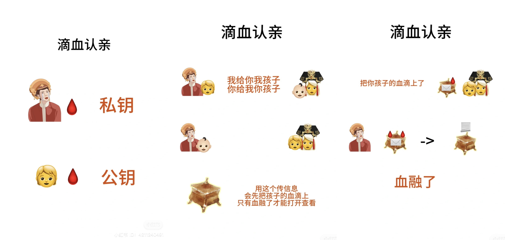

# 非对称加密

在对称加密中加密和解密都用的同一个密钥。既然双方都要有这个密钥，密钥传输可能会被截获不安全，所以有了非对称加密
	
## 非对称加密是什么
每一端都有两个密钥，一个公钥和一个私钥。公钥是公开的，用来加密。私钥只有自己有，用来解密。
别人用我们的公钥加密的密文只有自己的私钥可以解开。所以就算中间被截获了，攻击者也解不开
	
这对应着图里的，自己的孩子的血只能和自己的融，外人的血融不了。所以那个宝箱也打不开
